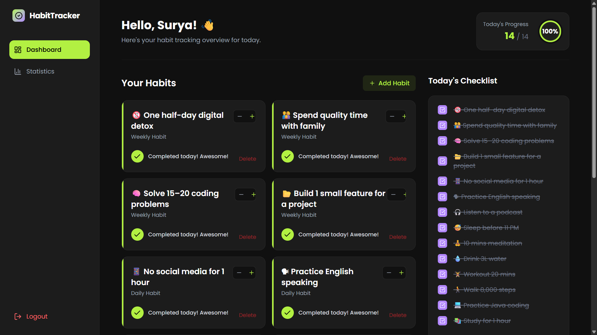
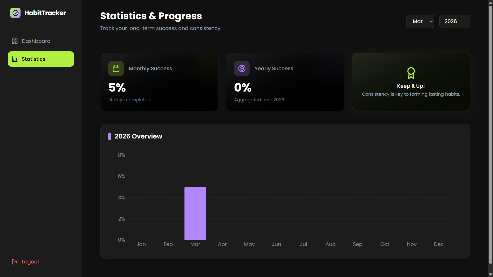

# 🟢 Habit Tracker

A modern full-stack Habit Tracking web application designed to help users build consistency, track daily habits, and visualize long-term progress.

Built using React, Tailwind CSS, Node.js, and Express with clean modular architecture.

---

## 🚀 Features

- ✅ Add & delete habits
- 📋 Daily checklist system
- ➕ Increment / decrement progress
- 🎯 Real-time daily completion tracking
- 📊 Monthly success analytics
- 📈 Yearly progress visualization
- 🌙 Modern dark UI design
- 📱 Fully responsive layout

---

## 🖼 Screenshots

### 📌 Dashboard (Incomplete vs Completed)

  

---

### 📊 Statistics Page

  

---

## 🧠 Architecture

Frontend (React + Tailwind CSS)  
⬇  
REST API (Node.js + Express)  
⬇  
Database Layer (MongoDB / SQL ready)

This project follows clear separation of concerns between frontend and backend for scalability and maintainability.

---

## 📂 Project Structure

Habit-Tracker/
│
├── backend/
│ ├── middleware/ # Custom middleware logic
│ ├── routes/ # API routes (auth, habits, progress, stats)
│ ├── db.js # Database configuration
│ ├── server.js # Express server entry point
│ └── package.json # Backend dependencies
│
├── frontend/
│ ├── public/ # Static assets
│ ├── src/
│ │ ├── components/ # Reusable UI components
│ │ ├── pages/ # Dashboard, Statistics pages
│ │ ├── context/ # Global state management
│ │ └── main.jsx # React entry file
│ ├── index.html
│ └── package.json # Frontend dependencies
│
├── screenshots/
├── .gitignore
└── README.md

---

## 🛠 Tech Stack

### Frontend
- React.js
- Tailwind CSS
- Vite

### Backend
- Node.js
- Express.js
- REST API architecture

### Tools
- Git & GitHub
- ESLint
- Antigravity   

---

## ⚙️ Installation & Setup

### 1️⃣ Clone Repository

git clone https://github.com/Surya15062/Habit-Tracker.git

cd Habit-Tracker

---

### 2️⃣ Backend Setup

cd backend
npm install
npm start 

Backend runs on: http://localhost:5000

---

### 3️⃣ Frontend Setup

cd frontend
npm install
npm run dev

Frontend runs on: http://localhost:5173

---

## 📝 Usage

1. Start the backend server.
2. Run the frontend application.
3. Open the app in your browser.
4. Add new habits using the **"Add Habit"** button.
5. Mark habits as complete using the checkbox.
6. Track your performance on the **Statistics** page.

---

## 📊 Key Highlights

- Well-structured modular folder architecture
- Scalable full-stack application design
- RESTful API development using Express
- Context-based global state management
- Clean UI with responsive dark theme
- Professional Git version control workflow

---

## 🔮 Future Enhancements

- JWT-based authentication & authorization
- Habit streak tracking system
- Email notifications & reminders
- Cloud deployment (Vercel / Render)
- Production-grade database integration
- User profile & personalization

---

## 👨‍💻 Author

**Surya**  
B.Tech – Information Technology  
Aspiring Java Developer  

---

> *"Consistency beats motivation. Small daily improvements lead to big success."*

---

## 🤝 Contributing

Contributions are welcome!  
Feel free to fork this repository and submit a pull request.
